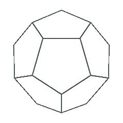
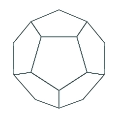
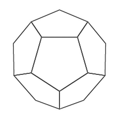
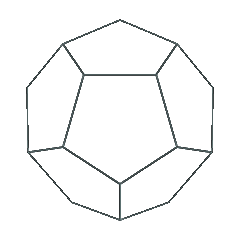
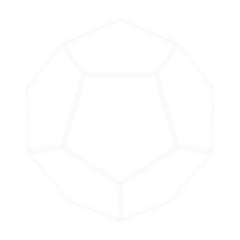

# Comparison of filesize after conversion png to txi

## RGB 8 
  
PNG image data, 240 x 240, 8-bit colormap, non-interlaced  
d12_8_dark.png **14KB**  
d12_8_dark.png.txi **99KB**

## Grayscale  
  
PNG image data, 240 x 240, 8-bit colormap, non-interlaced  
d12_8_grayscale_dark.png **29KB**  
d12_8_grayscale_dark.png.txi **24KB**  

## RGB 8 Indexed  
  
PNG image data, 240 x 240, 8-bit colormap, non-interlaced  
d12_8_indexed_dark.png **7KB**  
d12_8_indexed_dark.png.txi **13KB**  

## RGBa  
  
PNG image data, 240 x 240, 8-bit/color RGBA, non-interlaced  
d12_24_dark.png **30KB**  
d12_24.png_dark.txi **99KB**  

## Grayscale
  
PNG image data, 240 x 240, 8-bit gray+alpha, non-interlaced  
d12_24_grayscale_dark.png **24KB**  
d12_24_grayscale_dark.png.txi **13KB**  

## RGBa Indexed
  
PNG image data, 240 x 240, 8-bit colormap, non-interlaced  
d12_24_indexed_dark.png **6KB**  
d12_24_indexed_dark.png.txi **13KB**  

**Light**  

## RGB 8  
  
PNG image data, 240 x 240, 8-bit colormap, non-interlaced  
d12_8.png **14KB**  
d12_8.png.txi **99KB**

## Grayscale
  
PNG image data, 240 x 240, 8-bit colormap, non-interlaced  
d12_8_grayscale.png **27KB**  
d12_8_grayscale.png.txi **24KB**  

## RGB 8 Indexed  
  
PNG image data, 240 x 240, 8-bit colormap, non-interlaced  
d12_8_indexed.png **8KB**  
d12_8_indexed.png.txi **13KB**  

## RGBa
  
PNG image data, 240 x 240, 8-bit/color RGBA, non-interlaced  
d12_24.png **27KB**  
d12_24.png.txi **99KB**  

## Grayscale  
  
PNG image data, 240 x 240, 8-bit gray+alpha, non-interlaced  
d12_24_grayscale.png **22KB**  
d12_24_grayscale.png.txi **13KB**  

## RGBa Indexed  
  
PNG image data, 240 x 240, 8-bit colormap, non-interlaced  
d12_24_indexed.png **6KB**  
d12_24_indexed.png.txi **13KB**  